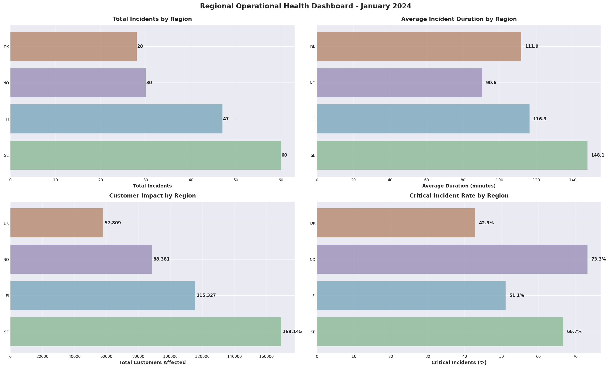

# Vattenfall Energy Data Lakehouse - Capstone Project

## Overview

This capstone project simulates a production-grade Databricks implementation for Vattenfall, a leading European energy company. The project demonstrates end-to-end data engineering practices for the energy sector, transforming raw operational data into actionable insights through a governed medallion architecture.

## Business Context

Energy companies like Vattenfall operate in a complex environment where multiple data streams must be integrated to:
- Optimize energy trading decisions based on real-time market prices
- Predict grid load and maintenance needs using weather patterns
- Monitor grid health and respond to incidents proactively
- Maintain compliance with regulatory reporting requirements

This project builds a scalable data lakehouse that unifies these data sources to enable operational excellence and data-driven decision making.

## Data Sources

### 1. Energy Market Price Data
Real-time and historical pricing information from energy markets including:
- Spot prices (day-ahead and intraday markets)
- Forward curves and futures contracts
- Regional price variations
- Supply and demand indicators

### 2. Weather Observations
Meteorological data critical for energy forecasting:
- Temperature, wind speed, and solar irradiance
- Historical weather patterns
- Weather station locations and measurements
- Correlation with energy demand and renewable generation

### 3. Grid Telemetry & Incident Events
Operational data from the electrical grid:
- Real-time sensor readings from substations and transmission lines
- Power flow measurements
- Incident logs and outage events
- Maintenance records and asset health indicators

### 4. Reference Data
Master data and dimensional information:
- Geographic location hierarchies
- Asset catalogs and specifications
- Customer segments
- Regulatory and compliance metadata

## Architecture

The project implements a **medallion architecture** with progressive data refinement:

### Bronze Layer (Raw Ingestion)
- Ingests raw files from all source systems
- Preserves original data format and structure
- Implements schema-on-read patterns
- Tracks data lineage and audit metadata

### Silver Layer (Cleaned & Conformed)
- Cleanses and validates data quality
- Standardizes formats, timestamps, and units
- Implements slowly changing dimensions (SCD)
- Joins and enriches datasets
- Handles deduplication and error records

### Gold Layer (Business-Level Aggregates)
- Creates business-ready aggregations and KPIs
- Implements dimensional models for analytics
- Pre-calculates metrics for reporting performance
- Enforces data governance and access policies

### Reporting Layer
- Powers dashboards and BI tools
- Supports ad-hoc analysis and data science use cases
- Provides APIs for downstream consumption
- Enables self-service analytics

## Project Objectives

By the end of this capstone, you will have built:

1. **Automated Data Pipelines** using Lakeflow Spark Declarative Pipelines (SDP)
2. **Unity Catalog Governance** with fine-grained access controls
3. **Data Quality Frameworks** with expectations and monitoring
4. **Performance-Optimized Tables** using Delta Lake features
5. **Production-Ready Dashboards** for operational and executive reporting
6. **End-to-End Data Lineage** from source to consumption

## Weekly Deliverables

Each week focuses on a specific aspect of the lakehouse:

- **Week 1**: Environment setup and bronze layer ingestion
- **Week 2**: Silver layer transformations and data quality
- **Week 3**: Gold layer business metrics and dimensional models
- **Week 4**: Dashboards, governance, and production deployment

## Technology Stack

- **Platform**: Databricks on AWS
- **Storage**: Delta Lake with Unity Catalog
- **Compute**: Serverless and provisioned clusters
- **Orchestration**: Databricks Jobs
- **Languages**: Python, SQL
- **Visualization**: Databricks Dashboards (Lakeview)

## Getting Started

1. Navigate to the `notebooks/` directory for pipeline code
2. Review `data/` folder for sample input files
3. Check `dashboards/` for visualization definitions
4. Follow the weekly guides in `docs/` for step-by-step instructions
5. Run inspection queries in `sql/` to validate data quality

## Project Structure

```
vattenfall-capstone-project/
├── README.md
├── notebooks/
│   ├── bronze/
│   ├── silver/
│   │   ├── 03_silver_grid_events.py
│   │   ├── 04_silver_asset_reference.py
│   │   └── 05_silver_regional_operations_integrated.py
│   └── gold/
├── pipelines/
├── src/
│   └── transforms/
│       ├── grid_event_transforms.py
│       ├── asset_reference_transforms.py
│       ├── integration_transforms.py
│       ├── market_price_transforms.py
│       └── weather_transforms.py
├── data/
│   ├── energy_prices/
│   ├── weather/
│   ├── grid_telemetry/
│   └── reference/
├── sql/
│   └── 04_silver_inspection_examples.sql
├── dashboards/
└── docs/
    └── 04_silver_layer_documentation.md
```

─────────────────────────────────────────────────────────────────────────────

## Bronze Layer Overview

**📦 Raw Data Ingestion Foundation**

**Tables Created (5):**
* `bronze_grid_events` - Grid incident events and outages (165 records)
* `bronze_substations` - Substation asset catalog (25 records)
* `bronze_regions` - Geographic reference data (25 regions)
* `bronze_market_prices` - Energy market pricing data
* `bronze_weather_obs` - Weather station observations

**Key Features:**
* ✅ Schema-on-read with Auto Loader
* ✅ Original data preservation (including `_rescued_data`)
* ✅ Audit columns: `source_system`, `last_updated_ts`
* ✅ Delta Lake format for ACID transactions
* ✅ Incremental ingestion ready

**Data Lineage:**
* Source: CSV files in `/data/` directories
* Destination: `vattenfall_dev.raw` schema
* Ingestion pattern: Batch loading with full history

─────────────────────────────────────────────────────────────────────────────

## Silver Layer Overview

## 🔍 Critical Findings

**High-Priority Actions:**
   * 🔴 SUB105 (Finland): 26 yrs, 800 MVA, 4,766 customers - REPLACE
   * 🔴 SUB136 (Finland): 28 yrs, 800 MVA, 2,202 customers - REPLACE

**Regional Performance:**
   * 🟠 Turku: 1,200 population impact rate - CAPACITY EXPANSION NEEDED
   * 🟠 Copenhagen: 228 min avg duration - IMPROVE RESTORATION SPEED
   * 🟠 Finland: 58% of events - INFRASTRUCTURE INVESTMENT REQUIRED

**Data Quality Issue:**
   * ⚠️  153 of 165 events lack asset reference data
   * →  Production requires complete asset reference dataset


─────────────────────────────────────────────────────────────────────────────

## Gold Layer Overview

**📊 Business Analytics Layer**  
**Analysis Period:** January 1-15, 2024 | **165 incidents | 430,662 customers affected**

### Key Findings

#### 🔴 Country Operational Health

| Country | Health Score | Rating | Key Issue |
|---------|-------------|--------|-----------|
| Denmark | 49.2 | FAIR | 228 min avg restoration (slowest response) |
| Norway | 49.2 | FAIR | One catastrophic day: Jan 4 (22,067 customers) |
| Finland | 39.3 | POOR | 58% of total incidents + premium pricing |
| **Sweden** | **34.0** | **CRITICAL** | 60 incidents (36% of Nordic) + 169K customers affected |

**Critical Finding:** Zero EXCELLENT operational days across all regions. 73% of region-days triggered operational alerts.

#### 🏭 Worst-Performing Substations

| Rank | Substation | Performance Score | Age | Region | Action |
|------|------------|------------------|-----|--------|--------|
| 1 | SUB128 | 45.0 | 24 yrs | Sweden | IMMEDIATE REPLACEMENT |
| 2 | SUB149 | 43.5 | 22 yrs | Finland | IMMEDIATE REPLACEMENT |
| 3 | SUB112 | 41.0 | 20 yrs | Sweden | HIGH PRIORITY |

**Paradox:** SUB121 (10 yrs old) ranks #2 despite being "modern" - requires investigation.

#### 🌧️ Weather vs. Aging Infrastructure

* **67%** of incidents involve adverse weather (cold, wind, precipitation)
* **50%** of incidents involve aging assets (15+ years)
* **33%** show compounding risk (both weather + aging)

**Insight:** Weather alone doesn't cause failures—aging infrastructure amplifies weather impact. Modern assets withstand the same conditions.

─────────────────────────────────────────────────────────────────────────────

## Regional Operational Health Dashboard

**Executive Summary Visualization - January 2024**



### Dashboard Highlights

The 4-panel executive dashboard provides a comprehensive view of Nordic grid operations:

**📊 Total Incidents by Region**
* Sweden (SE): 60 incidents - Highest operational load
* Finland (FI): 47 incidents
* Norway (NO): 30 incidents  
* Denmark (DK): 28 incidents

**⏱️ Average Incident Duration**
* Sweden (SE): 148.1 minutes - Longest restoration time
* Finland (FI): 116.3 minutes
* Denmark (DK): 111.9 minutes
* Norway (NO): 90.6 minutes - Fastest recovery

**👥 Customer Impact**
* Sweden (SE): 169,145 customers affected - Highest impact
* Finland (FI): 115,327 customers
* Norway (NO): 88,381 customers
* Denmark (DK): 57,809 customers
* **Total**: 430,662 customers affected across all regions

**🚨 Critical Incident Rate**
* Shows percentage of critical priority incidents by region
* Enables risk-based resource allocation
* Identifies regions requiring immediate operational attention

### Key Insights

* **Sweden** requires urgent attention across all metrics - highest incident count, longest duration, and greatest customer impact
* **Norway** demonstrates operational excellence with fastest recovery times despite moderate incident volume
* **57.5-minute gap** between fastest (NO) and slowest (SE) recovery indicates significant opportunity for process improvement
* Regional patterns suggest infrastructure investment priorities for 2024-2025


─────────────────────────────────────────────────────────────────────────────