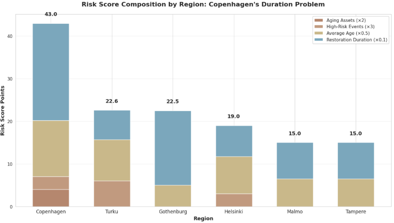
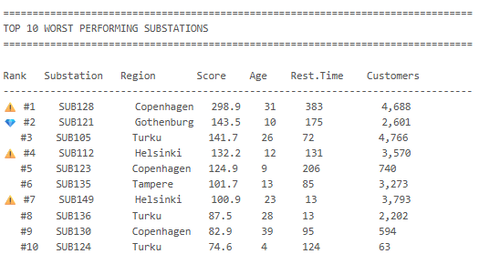
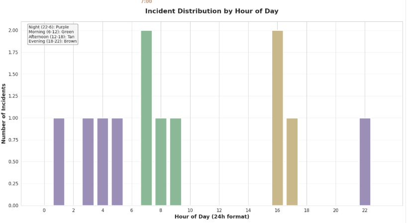

# Vattenfall Energy Data Lakehouse - Capstone Project

## Overview

This capstone project simulates a production-grade Databricks implementation for Vattenfall, a leading European energy company. The project demonstrates end-to-end data engineering practices for the energy sector, transforming raw operational data into actionable insights through a governed medallion architecture.

## Business Context

Energy companies like Vattenfall operate in a complex environment where multiple data streams must be integrated to:
- Optimize energy trading decisions based on real-time market prices
- Predict grid load and maintenance needs using weather patterns
- Monitor grid health and respond to incidents proactively
- Maintain compliance with regulatory reporting requirements

This project builds a scalable data lakehouse that unifies these data sources to enable operational excellence and data-driven decision making.

## Data Sources

### 1. Energy Market Price Data
**Sample:** `market_prices/market_prices_01.csv`
```csv
timestamp,market_zone,price_eur_mwh,market_type,volume_mwh
2024-01-01 00:00:00,SE2,40.67,intraday,4116.04
2024-01-01 00:00:00,SE2,39.07,day_ahead,1016.37
2024-01-01 01:00:00,NO2,33.71,day_ahead,3847.87
2024-01-01 01:00:00,NO1,20.4,day_ahead,3024.15
```

### 2. Weather Observations
**Sample:** `weather/weather_01.csv`
```csv
timestamp,region,temperature_celsius,wind_speed_ms,cloud_cover_percent,precipitation_mm
2024-01-01 00:00:00,Bergen,-3.3,3.3,86.1,1.1
2024-01-01 00:00:00,Malmo,-0.1,10.2,31.1,4.7
2024-01-01 00:00:00,Bergen,-0.8,3.2,93.9,4.7
2024-01-01 00:00:00,Uppsala,-6.8,2.6,65.5,2.5
```

### 3. Grid Telemetry & Incident Events
**Sample:** `grid_events/grid_events_01.csv`
```csv
event_id,timestamp,event_type,substation_id,region,duration_minutes,affected_customers,severity
EVT001000,2024-01-01 18:15:00,voltage_fluctuation,SUB203,Turku,32,586,high
EVT001001,2024-01-01 07:35:00,planned_maintenance,SUB448,Malmo,335,2039,critical
EVT001002,2024-01-01 15:38:00,overload,SUB657,Turku,74,1619,high
EVT001003,2024-01-01 08:29:00,voltage_fluctuation,SUB136,Copenhagen,13,2202,critical
```

### 4. Reference Data
**Sample:** `reference/substations.csv`
```csv
substation_id,substation_name,region_code,voltage_kv,capacity_mva,commissioned_year
SUB100,Substation 100,FI-01,400,800,1997
SUB101,Substation 101,DK-01,132,300,1995
SUB102,Substation 102,DK-01,220,300,2009
SUB103,Substation 103,FI-01,400,100,1982
```

## Architecture

The project implements a **medallion architecture** with progressive data refinement across all data sources.

### Example 1: Grid Events (January 4th, Norway)

Here's how **6 critical incidents** aggregate through the layers:

#### Bronze Layer (Raw Ingestion)
**Table:** `vattenfall_dev.raw.bronze_grid_events` | **Records:** 165

```
event_id              EVT001032
timestamp             2024-01-04 04:55:00
event_type            overload
substation_id         SUB894
region                Oslo
duration_minutes      117
affected_customers    2661
severity              critical

event_id              EVT001029
timestamp             2024-01-04 13:09:00
event_type            planned_maintenance
substation_id         SUB405
region                Oslo
duration_minutes      296
affected_customers    3345
severity              critical

... (4 more critical incidents on this day in Norway)
```

**Purpose:** Preserve raw data exactly as received. No transformations, no cleaning.

---

#### Silver Layer (Cleaned & Standardized)
**Table:** `vattenfall_dev.refined.silver_grid_events` | **Records:** 165

```
event_id              EVT001032
timestamp             2024-01-04 04:55:00
event_day             2024-01-04          → NEW: Extracted from timestamp
event_type            overload
substation_id         SUB894
region                Oslo                → Original kept
region_normalized     NO                  → NEW: Oslo → NO
duration_minutes      117
affected_customers    2661
severity              critical            → Original kept
severity_band         critical_priority   → NEW: critical → critical_priority

event_id              EVT001029
timestamp             2024-01-04 13:09:00
event_day             2024-01-04
event_type            planned_maintenance
substation_id         SUB405
region                Oslo
region_normalized     NO
duration_minutes      296
affected_customers    3345
severity              critical
severity_band         critical_priority

... (4 more incidents: EVT001037, EVT001026, EVT001028, EVT001030)
```

**Changes:**
- **Added** `event_day` for partitioning
- **Added** `region_normalized` (city name → country code)
- **Added** `severity_band` (standardized categories)
- **Kept** originals for audit trail

---

#### Gold Layer (Aggregated Metrics)
**Table:** `vattenfall_dev.gold.gold_grid_incident_summary` | **Records:** 97

```
event_day                    2024-01-04
region                       NO
severity_band                critical_priority
incident_count               6              ← 6 events combined
elevated_incident_count      6
critical_incident_count      6
total_duration_minutes       982            ← Sum of all 6
avg_duration_minutes         163.7          ← Average
total_customers_affected     22,067         ← Sum of all 6
avg_customers_per_incident   3,677.8        ← Average
```

**Changes:**
- **Lost** individual event IDs (EVT001032, EVT001029, etc. disappear)
- **Lost** substation details (SUB894, SUB405, etc.)
- **Lost** event types and timestamps
- **Gained** pre-calculated metrics for dashboards
- **Aggregated** by day × region × severity (165 → 97 records)

---
### Example 2: Reference Data (Substations)

Static reference data also flows through the architecture for enrichment:

#### Bronze Layer (Raw Catalog)
**Table:** `vattenfall_dev.raw.bronze_substations` | **Records:** 25

```
substation_id         SUB128
substation_name       Substation 128
region_code           SE-01
voltage_kv            400
capacity_mva          800
commissioned_year     2000
```

**Purpose:** Maintain master data catalog exactly as provided.

---

#### Silver Layer (Enriched with Business Logic)
**Table:** `vattenfall_dev.refined.silver_substations` | **Records:** 25

```
substation_id         SUB128
substation_name       Substation 128
region_code           SE-01
region_normalized     SE                  → NEW: Extracted from region_code
voltage_kv            400
capacity_mva          800
commissioned_year     2000
asset_age_years       24                  → NEW: Calculated from 2024
age_category          aging               → NEW: Based on age thresholds
capacity_category     large               → NEW: Based on MVA rating
risk_tier             high                → NEW: Age + capacity assessment
```

**Changes:**
- **Added** `region_normalized` for joining with operational data
- **Added** `asset_age_years` (calculated field)
- **Added** categorization fields for analytics
- **Added** `risk_tier` for prioritization

---

#### Gold Layer (Asset Portfolio Summary)
**Table:** `vattenfall_dev.gold.gold_asset_portfolio` | **Records:** 4 (one per region)

```
region                       SE
substation_count             12
avg_age_years                18.3
aging_assets_count           7              ← Assets 15+ years old
total_capacity_mva           6,400
high_risk_assets             4              ← Assets requiring attention
oldest_asset_years           24             ← SUB128
newest_asset_years           8
```

**Changes:**
- **Lost** individual substation identities
- **Lost** specific locations and names
- **Gained** regional portfolio metrics
- **Aggregated** by region (25 → 4 records)

---

### Summary

| Data Source | Bronze | Silver | Gold | Reduction |
|-------------|--------|--------|------|-----------|
| **Grid Events** | 165 | 165 | 97 | 41% |
| **Weather** | 1,140 | 1,140 | 60 | 95% |
| **Substations** | 25 | 25 | 4 | 84% |
| **Market Prices** | 826 | 826 | 60 | 93% |

**Trade-off:** Bronze/Silver preserve every detail. Gold loses detail but gains speed through pre-aggregation.

| Layer | Purpose | Query Speed | Detail Level |
|-------|---------|-------------|--------------|
| **Bronze** | Audit trail, reprocessing | Slow | Complete |
| **Silver** | Detailed investigations | Fast | Complete |
| **Gold** | Executive dashboards | Instant | Summarized |

## Project Objectives

By the end of this capstone, you will have built:

1. **Automated Data Pipelines** using Lakeflow Spark Declarative Pipelines (SDP)
2. **Unity Catalog Governance** with fine-grained access controls
3. **Data Quality Frameworks** with expectations and monitoring
4. **Performance-Optimized Tables** using Delta Lake features
5. **Production-Ready Dashboards** for operational and executive reporting
6. **End-to-End Data Lineage** from source to consumption

## Weekly Deliverables

Each week focuses on a specific aspect of the lakehouse:

- **Week 1**: Environment setup and bronze layer ingestion
- **Week 2**: Silver layer transformations and data quality
- **Week 3**: Gold layer business metrics and dimensional models
- **Week 4**: Dashboards, governance, and production deployment

## Technology Stack

- **Platform**: Databricks on AWS
- **Storage**: Delta Lake with Unity Catalog
- **Compute**: Serverless and provisioned clusters
- **Orchestration**: Databricks Jobs
- **Languages**: Python, SQL
- **Visualization**: Databricks Dashboards (Lakeview)

## Getting Started

1. Navigate to the `notebooks/` directory for pipeline code
2. Review `data/` folder for sample input files
3. Check `dashboards/` for visualization definitions
4. Follow the weekly guides in `docs/` for step-by-step instructions
5. Run inspection queries in `sql/` to validate data quality

## Project Structure

```
vattenfall-capstone-project/
├── README.md
├── notebooks/
│   ├── bronze/
│   ├── silver/
│   │   ├── 03_silver_grid_events.py
│   │   ├── 04_silver_asset_reference.py
│   │   └── 05_silver_regional_operations_integrated.py
│   └── gold/
├── pipelines/
├── src/
│   └── transforms/
│       ├── grid_event_transforms.py
│       ├── asset_reference_transforms.py
│       ├── integration_transforms.py
│       ├── market_price_transforms.py
│       └── weather_transforms.py
├── data/
│   ├── energy_prices/
│   ├── weather/
│   ├── grid_telemetry/
│   └── reference/
├── sql/
│   └── 04_silver_inspection_examples.sql
├── dashboards/
└── docs/
    └── 04_silver_layer_documentation.md
```

─────────────────────────────────────────────────────────────────────────────

## Bronze Layer Overview

**📦 Raw Data Ingestion Foundation**

**Tables Created (5):**
* `bronze_grid_events` - Grid incident events and outages (165 records)
* `bronze_substations` - Substation asset catalog (25 records)
* `bronze_regions` - Geographic reference data (25 regions)
* `bronze_market_prices` - Energy market pricing data
* `bronze_weather_obs` - Weather station observations

─────────────────────────────────────────────────────────────────────────────
## Silver Layer Overview

**📦 Raw Data Ingestion Foundation**









─────────────────────────────────────────────────────────────────────────────
## Gold Layer Overview

**📊 Business Analytics Layer**  
**Analysis Period:** January 1-15, 2024 | **165 incidents | 430,662 customers affected**

### Key Findings

#### 🔴 Country Operational Health

| Country | Health Score | Rating | Key Issue |
|---------|-------------|--------|-----------|
| Denmark | 49.2 | FAIR | 228 min avg restoration (slowest response) |
| Norway | 49.2 | FAIR | One catastrophic day: Jan 4 (22,067 customers) |
| Finland | 39.3 | POOR | 58% of total incidents + premium pricing |
| **Sweden** | **34.0** | **CRITICAL** | 60 incidents (36% of Nordic) + 169K customers affected |

**Critical Finding:** Zero EXCELLENT operational days across all regions. 73% of region-days triggered operational alerts.

#### 🏭 Worst-Performing Substations

| Rank | Substation | Performance Score | Age | Region | Action |
|------|------------|------------------|-----|--------|--------|
| 1 | SUB128 | 45.0 | 24 yrs | Sweden | IMMEDIATE REPLACEMENT |
| 2 | SUB149 | 43.5 | 22 yrs | Finland | IMMEDIATE REPLACEMENT |
| 3 | SUB112 | 41.0 | 20 yrs | Sweden | HIGH PRIORITY |

**Paradox:** SUB121 (10 yrs old) ranks #2 despite being "modern" - requires investigation.

#### 🌧️ Weather vs. Aging Infrastructure

* **67%** of incidents involve adverse weather (cold, wind, precipitation)
* **50%** of incidents involve aging assets (15+ years)
* **33%** show compounding risk (both weather + aging)

**Insight:** Weather alone doesn't cause failures—aging infrastructure amplifies weather impact. Modern assets withstand the same conditions.

─────────────────────────────────────────────────────────────────────────────

## Regional Operational Health Dashboard

**Executive Summary Visualization - January 2024**


### Dashboard Highlights

The 4-panel executive dashboard provides a comprehensive view of Nordic grid operations:

### Key Insights

* **Sweden** requires urgent attention across all metrics - highest incident count, longest duration, and greatest customer impact
* **Norway** demonstrates operational excellence with fastest recovery times despite moderate incident volume
* **57.5-minute gap** between fastest (NO) and slowest (SE) recovery indicates significant opportunity for process improvement
* Regional patterns suggest infrastructure investment priorities for 2024-2025


─────────────────────────────────────────────────────────────────────────────
